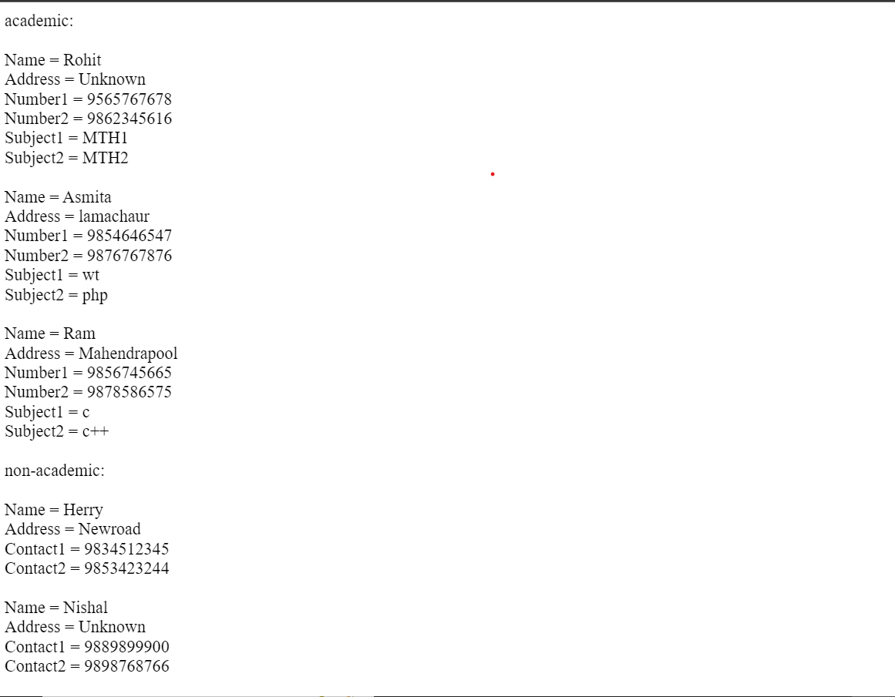

# DATE:2022/06/21-2022/06/22

<h1>Introduction to Sorting in PHP</h1>
Sorting is to arrange the elements of an array in a particular order. PHP performs sorting on
 normal arrays like a numeric array and on associative arrays. 

 Normal arrays like numeric arrays can be sorted by using the simple sort() function,
  and to perform the sorting on the
  associative array, we have different functions.

The elements in an array can be sorted in alphabetical or numerical order, descending or ascending.

 <h1>PHP - Sort Functions For Arrays</h2>

In this chapter, we will go through the following PHP array sort functions:

-   `sort()`  - sort arrays in ascending order
-   `rsort()`  - sort arrays in descending order
-   `asort()`  - sort associative arrays in ascending order, according to the value
-   `ksort()`  - sort associative arrays in ascending order, according to the key
-   `arsort()`  - sort associative arrays in descending order, according to the value
-   `krsort()`  - sort associative arrays in descending order, according to the key

